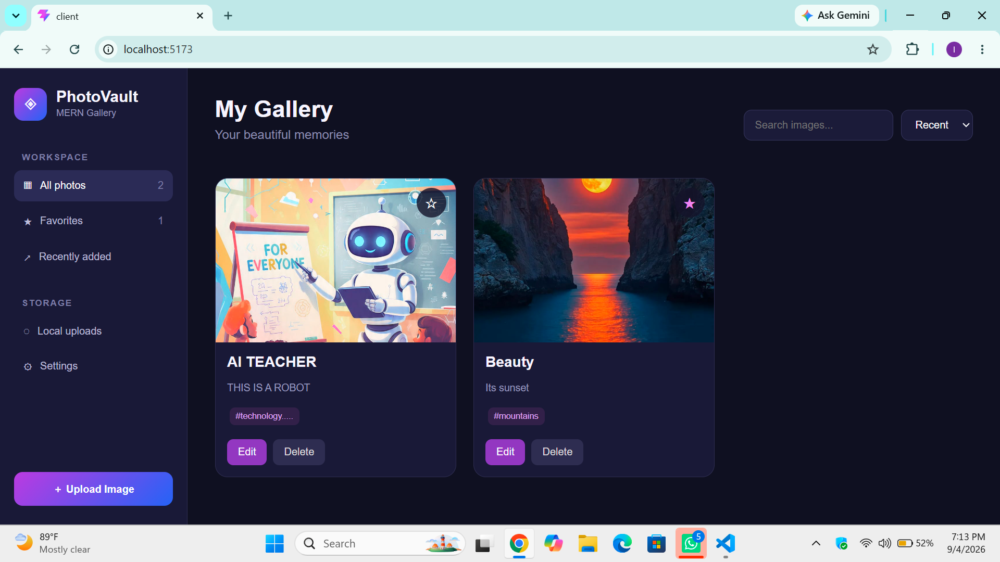
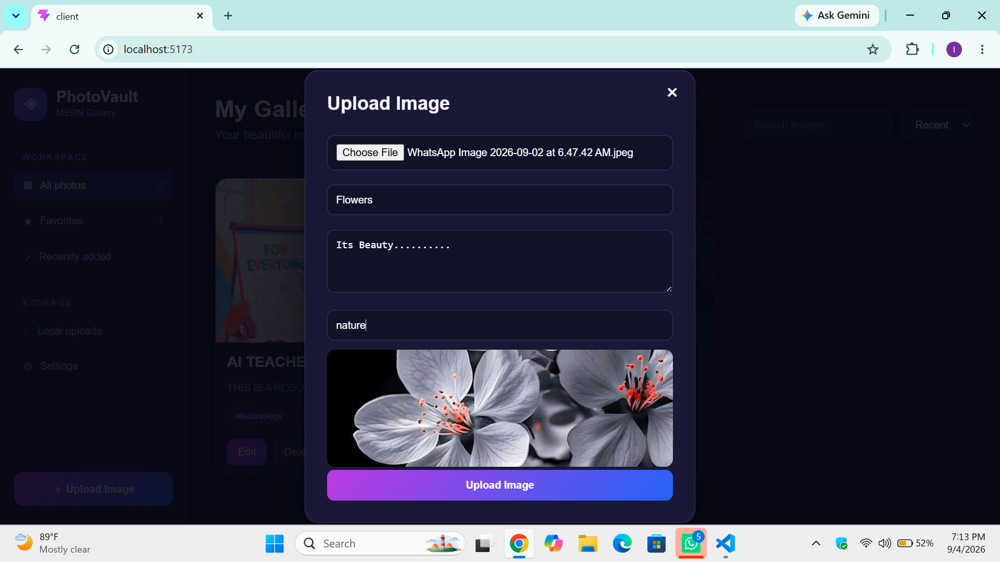
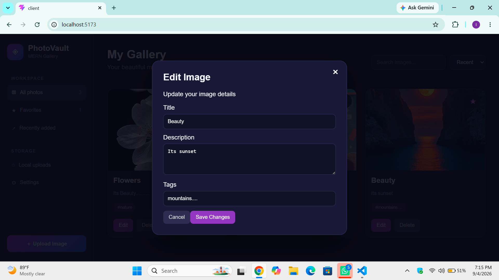
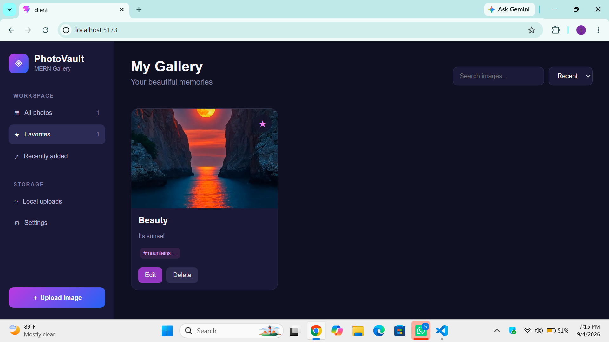
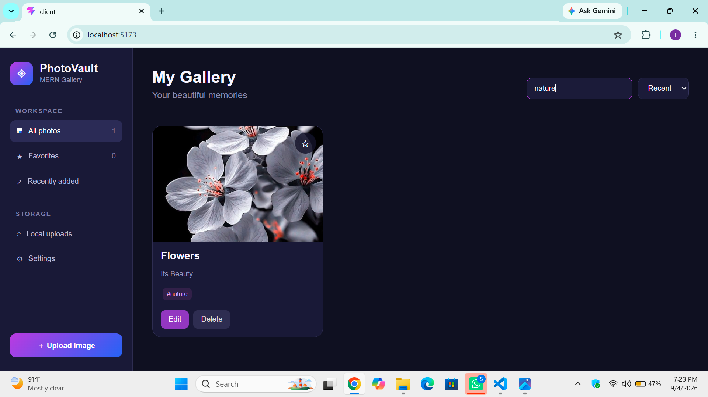
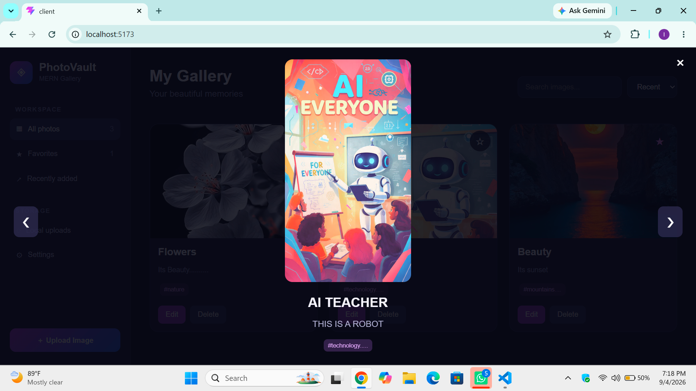

# 📸 PhotoVault — MERN Gallery

> **A modern full-stack image gallery built with the MERN Stack, featuring image metadata, editing, favorites, search, sorting, image preview, viewer navigation, and reliable user experience.**

---

## 🎓 Assignment Information

**University:** University of Gujrat
**Society:** Hayyatian Computing Society
**Course:** MERN / Full Stack Development
**Assignment:** Building a MERN Gallery — Feature Upgrade
**Instructor:** Kamran Ahsan

---

# 🌟 Project Overview

**PhotoVault** is a full-stack image gallery application developed using the **MERN Stack**.

The application allows users to upload images to a local server and manage them through an attractive gallery interface.

The project extends the provided gallery starter by adding four major feature upgrades:

* 🏷️ Image Metadata
* ✏️ Metadata Editing
* ⭐ Favorites & Image Discovery
* ⚡ Reliable User Experience

The original gallery functionality is also maintained, including image upload, gallery display, full-screen viewing, Previous/Next navigation, and deletion.

---

# 🚀 Features

## 📤 1. Image Upload

Users can upload images directly from the browser.

The upload form includes:

* Image file selection
* Image preview
* Title
* Description
* Tags
* Upload progress
* Validation
* Error messages

Images are uploaded using `multipart/form-data`.

The image itself is stored locally on the server inside:

```text
server/uploads
```

MongoDB stores the image URL and related metadata rather than storing the actual binary image.

---

## 🏷️ 2. Image Metadata

Each uploaded image can have additional information.

### Metadata fields

| Field       | Description               | Limit            |
| ----------- | ------------------------- | ---------------- |
| Title       | Name of the image         | 1–80 characters  |
| Description | Additional information    | 0–240 characters |
| Tags        | Keywords related to image | Maximum 5        |

Example:

```text
Title: Mountain Sunset

Description:
A beautiful sunset view from the mountains.

Tags:
nature, mountain, sunset, travel
```

Tags are normalized before being stored by:

* Removing extra spaces
* Removing empty tags
* Converting tags to lowercase

Metadata is displayed on both:

* 🖼️ Gallery cards
* 🔍 Full-screen image viewer

---

# ✏️ 3. Edit Image Details

Users can edit image metadata after uploading an image.

The image does **not** need to be uploaded again.

The Edit feature allows users to change:

* Title
* Description
* Tags

The edit form is automatically pre-filled with the existing metadata.

The application sends the updated information through:

```http
PATCH /api/images/:id
```

The actual image file and its image URL remain unchanged.

After a successful update, the gallery refreshes its displayed data without requiring a full browser refresh.

---

# ⭐ 4. Favorites

Users can mark important images as favorites using the star button.

Favorite status is stored in MongoDB using:

```text
isFavorite
```

The default value is:

```text
false
```

Users can:

* ⭐ Add an image to Favorites
* ☆ Remove an image from Favorites
* 📁 View only favorite images
* 🔄 Refresh the browser without losing favorite status

Because the favorite state is stored in MongoDB, it remains persistent after refreshing the page.

---

# 🔎 5. Search

The gallery includes a search feature.

Users can search images using:

* Title
* Description
* Tags

For example:

```text
nature
```

The gallery will display images whose title, description, or tags match the search.

If no image matches the search, a separate:

> **No images found**

state is displayed.

---

# 🗂️ 6. Filtering

The sidebar provides gallery filtering options.

### All Photos

Displays the normal gallery collection.

### Favorites

Displays only images marked as favorites.

The favorite filter works through the backend API and MongoDB query.

---

# 🕒 7. Sorting

Images can be sorted using two options:

### Recent

Displays the newest images first.

```text
Newest → Oldest
```

### Oldest

Displays the oldest images first.

```text
Oldest → Newest
```

Sorting is handled through the backend using the image creation date.

---

# 🖼️ 8. Image Preview

When a user selects an image for upload, the application displays a preview before uploading it.

This allows the user to confirm the selected image before submitting the form.

---

# 🔍 9. Full-Screen Image Viewer

Clicking an image opens it in a full-screen viewer.

The viewer displays:

* Large image
* Image title
* Description
* Tags
* Previous button
* Next button
* Close button

The user can easily move through the gallery without returning to the main page.

---

# ⏮️⏭️ 10. Previous / Next Navigation

The viewer provides:

```text
❮ Previous       Next ❯
```

The navigation allows users to move through the complete image collection.

When reaching the first or last image, navigation wraps around to the other side.

---

# 🗑️ 11. Delete Image

Users can delete an image from the gallery.

The delete operation:

1. Removes the image document from MongoDB.
2. Attempts to remove the corresponding local image file.
3. Updates the gallery after deletion.

API:

```http
DELETE /api/images/:id
```

---

# ⚡ 12. Reliable User Experience

Reliable UX is an important part of the upgraded assignment.

The application provides feedback for different states.

### 🔄 Loading State

While images are being loaded:

```text
Loading images...
```

is displayed.

### 📤 Upload Progress

During image upload, the user can see:

```text
Uploading... 45%
```

along with a progress indicator.

### ⚠️ API Error

If an API request fails, the application displays an understandable error message.

### 🔁 Retry

When loading fails, the user can press:

```text
Retry
```

to try the request again.

### 📭 Empty Gallery

If there are no uploaded images, the application displays an empty-gallery message.

### 🔎 No Search Results

If a search or favorite filter produces no results, the application displays a separate no-results message.

### ♿ Accessibility

The interface also uses:

* Descriptive `alt` text for images
* `aria-label` attributes where useful
* Semantic buttons
* Clear interactive controls

---

# 🎨 User Interface

PhotoVault uses a modern dark gallery interface with:

* 🌌 Dark navy background
* 💜 Purple/blue accent styling
* 📱 Responsive layout
* 🖼️ Card-based gallery
* ⭐ Favorite controls
* 🎯 Clear buttons
* 🔍 Search and sorting controls
* 🪟 Modal-based upload and editing

The gallery displays **3 images per row** on the main desktop layout.

---

# 🧩 Technology Stack

## Frontend

* React.js
* Vite
* Axios
* JavaScript
* CSS

## Backend

* Node.js
* Express.js
* Multer
* REST API

## Database

* MongoDB
* Mongoose

---

# 🏗️ Project Architecture

The project follows a simple MERN architecture:

```text
PhotoVault
│
├── client
│   └── React + Vite
│       │
│       ├── App.jsx
│       ├── api.js
│       ├── components
│       │   ├── Gallery.jsx
│       │   ├── Viewer.jsx
│       │   ├── UploadForm.jsx
│       │   └── Sidebar.jsx
│       └── CSS
│
└── server
    │
    ├── model
    │   └── image.js
    │
    ├── routes
    │   └── imageRoutes.js
    │
    ├── middleware
    │   └── upload.js
    │
    ├── uploads
    │
    └── server.js
```

---

# 🔌 API Endpoints

The application uses REST APIs for communication between React, Express, and MongoDB.

## Upload Image

```http
POST /api/images
```

Used to upload an image and its metadata.

Form fields:

```text
image
title
description
tags
```

---

## Get Images

```http
GET /api/images
```

Returns image records.

Supported query parameters include:

```text
search
favorite
sort
```

Example:

```http
GET /api/images?search=nature&favorite=true&sort=recent
```

---

## Update Metadata

```http
PATCH /api/images/:id
```

Updates:

```json
{
  "title": "Mountain Sunset",
  "description": "Beautiful sunset in the mountains",
  "tags": ["nature", "sunset", "travel"]
}
```

---

## Toggle Favorite

```http
PATCH /api/images/:id/favorite
```

Request body:

```json
{
  "isFavorite": true
}
```

---

## Delete Image

```http
DELETE /api/images/:id
```

Deletes the image record and attempts to remove its local file.

---

# 🗄️ MongoDB Image Model

Each image record contains information such as:

```text
imageUrl
title
description
tags
isFavorite
createdAt
```

### Example document

```json
{
  "imageUrl": "http://localhost:5000/uploads/example.jpg",
  "title": "Mountain Sunset",
  "description": "A beautiful mountain sunset",
  "tags": [
    "nature",
    "mountain",
    "sunset"
  ],
  "isFavorite": true,
  "createdAt": "2026-09-04T10:00:00.000Z"
}
```

---

# 🛡️ Validation

The application validates metadata on both the frontend and backend.

### Title

* Required
* Maximum 80 characters

### Description

* Optional
* Maximum 240 characters

### Tags

* Optional
* Maximum 5 tags
* Empty values are removed
* Tags are converted to lowercase

Validation prevents invalid data from being submitted.

---

# 💾 Data Persistence

Important user data is stored in MongoDB.

This means:

* Metadata remains after refresh.
* Favorite status remains after refresh.
* Uploaded image records remain available.
* Editing changes are persisted.

The actual image files remain on the local server.

No cloud image-storage service is used.

---

# ▶️ How to Run the Project

## 1. Clone the Repository

```bash
git clone YOUR_GITHUB_REPOSITORY_URL
```

Then:

```bash
cd YOUR_PROJECT_FOLDER
```

---

## 2. Start the Server

Open a terminal:

```bash
cd server
npm install
npm run dev
```

The backend runs on the configured server port.

---

## 3. Start the Client

Open another terminal:

```bash
cd client
npm install
npm run dev
```

Vite will provide the frontend URL in the terminal.

Open that URL in the browser.

---

# ⚙️ Environment Variables

The backend uses environment variables for configuration.

Example:

```env
PORT=5000
MONGO_URI=your_mongodb_connection_string
BASE_URL=http://localhost:5000
```

> `.env` should not be uploaded to GitHub.

---

# 🧪 Feature Testing Checklist

The following functionality was tested:

* [x] Image upload
* [x] Image preview
* [x] Title input
* [x] Description input
* [x] Tags input
* [x] Metadata display
* [x] Metadata editing
* [x] Favorite/unfavorite
* [x] Favorites filter
* [x] Search
* [x] Recent sorting
* [x] Oldest sorting
* [x] Image viewer
* [x] Previous navigation
* [x] Next navigation
* [x] Delete image
* [x] Loading state
* [x] Upload progress
* [x] API error handling
* [x] Retry functionality
* [x] Empty gallery state
* [x] No-results state
* [x] Data persistence after refresh

---

# 📸 Screenshots

Add your project screenshots below.

### 🏠 Main Gallery



### 📤 Upload Image



### ✏️ Edit Metadata



### ⭐ Favorites



### 🔎 Search



### 🖼️ Image Viewer



> Make sure the screenshot filenames match the files placed in your project.

---

# 📚 Learning Outcomes

Through this project, the following concepts were practiced:

* React component development
* React state management
* Form handling
* File uploads using `FormData`
* Axios API communication
* Express REST APIs
* Multer file handling
* MongoDB database operations
* Mongoose schemas and validation
* PATCH requests
* Query parameters
* Search and filtering
* Sorting database records
* Persistent favorite state
* Error handling
* Loading and progress states
* Accessibility
* Full-stack integration

---

# 🔐 Project Scope

This project intentionally focuses on the required MERN Gallery functionality.

The assignment does **not** require:

* Authentication
* Cloud storage
* Payments
* A second database
* Mobile application

Images are kept on the local server as required by the assignment.

---

# 👩‍💻 Developer

**Imza Sarwar**
Computer Science — University of Gujrat

---

# ✨ Final Result

PhotoVault provides a complete gallery experience where users can:

```text
📤 Upload
   ↓
🏷️ Add Metadata
   ↓
🖼️ View Images
   ↓
🔎 Search & Discover
   ↓
⭐ Favorite
   ↓
✏️ Edit Details
   ↓
🔄 Refresh & Keep Data
   ↓
🗑️ Delete
```

The project combines the original gallery functionality with the required feature upgrades to create a complete and user-friendly MERN image gallery.

---

## 💙 Built with MERN

**React.js • Vite • Node.js • Express.js • MongoDB • Mongoose • Axios**
